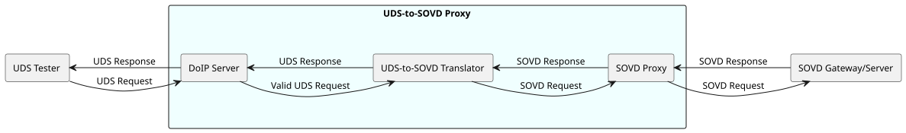
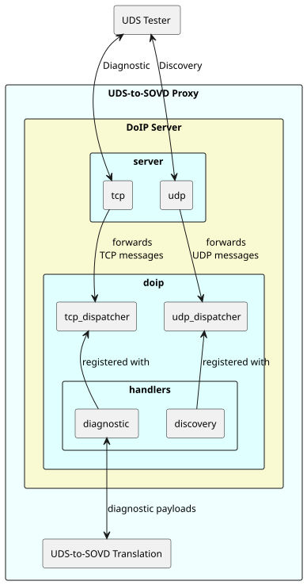

<!--
SPDX-License-Identifier: Apache-2.0
SPDX-FileCopyrightText: 2026 The Contributors to Eclipse OpenSOVD (see CONTRIBUTORS)

See the NOTICE file(s) distributed with this work for additional
information regarding copyright ownership.

This program and the accompanying materials are made available under the
terms of the Apache License Version 2.0 which is available at
https://www.apache.org/licenses/LICENSE-2.0
-->

# 🔌 UDS-to-SOVD Proxy 🚗

This repository contains the UDS-to-SOVD Proxy of the Eclipse OpenSOVD project and its documentation.

In the SOVD (Service-Oriented Vehicle Diagnostics) context, the UDS-to-SOVD Proxy serves as a
protocol translation gateway between legacy UDS (Unified Diagnostic Services) based diagnostic
tools and the modern SOVD-based diagnostic architecture.

It accepts UDS requests over DoIP (Diagnostics over IP), resolves the corresponding SOVD service
using the diagnostic description (MDD) of the ECU, and translates them into SOVD REST API calls.
The SOVD responses are then encoded back into UDS format and returned to the requesting tool.

This enables existing UDS-based diagnostic tools and workflows to seamlessly interact with
SOVD-enabled vehicle architectures without modification.

## goals

- 🔄 transparent UDS ↔ SOVD protocol translation
- 🚀 high performance (asynchronous I/O)
- 🤏 low memory and disk-space consumption
- 🛡️ safe & secure
- ⚡ fast startup
  
## Conceptual Architecture

The UDS-to-SOVD Proxy consists of three components:
1. **DoIP Server** - frontend interface for the UDS tester, handles DoIP discovery and diagnostic sessions, parses incoming DoIP messages, and dispatches them to the appropriate protocol handlers.
2. **UDS-to-SOVD translation** - translates UDS requests into SOVD REST API calls and vice-versa.
3. **SOVD Proxy** - backend to send HTTP requests to SOVD server & handles responses.



At a high level, testers use UDP for discovery and TCP for diagnostic sessions. Incoming DoIP messages are parsed and dispatched to protocol handlers. Diagnostic payloads are then transformed into SOVD REST API calls and sent to the SOVD server. The responses are then translated back into UDS format and returned to the tester.

The **DoIP Server** consists of below modules:
1. **Transport handling** - UDP for discovery & TCP for diagnostic sessions.
2. **Protocol processing** - DoIP protocol specific processing by dispatching requests to the handlers.



## Getting Started

```sh
cargo build

cargo run -p uds2sovd-proxy
```

To run uds2sovd-proxy with custom configuration refer to [Usage](docs/usage.md).

## Documentation

### Code Documentation (Rustdoc)

The core library documentation is the primary API reference.

```sh
# View the library documentation (main entry point)
cargo doc-lib

# Or without dependencies documentation:
cargo doc --package uds2sovd-proxy-lib --no-deps --open
```

This includes:
- API reference for all core modules
- Quick start examples
- Backend implementation guide

**Additional Resources:**

```sh
# View the server binary documentation
cargo doc --package uds2sovd-proxy --no-deps --open

# View the example client
cargo doc --package doip-example --no-deps --open

# View all workspace crates at once
cargo doc-all
```

### Further Reading

| Document | Description |
| --- | --- |
| [Detailed design](docs/detailed_design.md) | System architecture and design rationale |
| [Usage](docs/usage.md) | Usage guide |
| [Limitations](docs/limitation.md) | Current functional and operational limitations |
| [Future work](docs/todo.md) | TODO items and roadmap |


## developing

### pre commit
```shell
uv run https://raw.githubusercontent.com/eclipse-opensovd/cicd-workflows/main/run_checks.py
```
### codestyle

see [codestyle](CODESTYLE.md)

### testing

#### unit tests

Unittests are placed in the relevant module as usual in rust:
```rust
...
#[cfg(test)]
mod test {
    ...
}
```

Run unit tests with:
```shell
cargo test --locked --lib
```

#### integration tests
