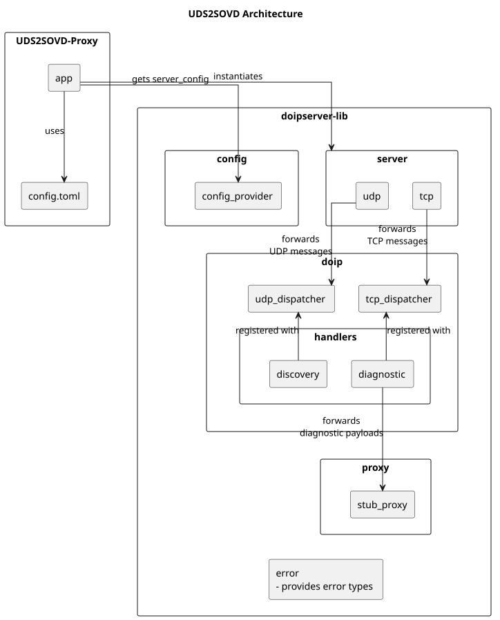

<!--
SPDX-License-Identifier: Apache-2.0
SPDX-FileCopyrightText: 2026 The Contributors to Eclipse OpenSOVD (see CONTRIBUTORS)

See the NOTICE file(s) distributed with this work for additional
information regarding copyright ownership.

This program and the accompanying materials are made available under the
terms of the Apache License Version 2.0 which is available at
https://www.apache.org/licenses/LICENSE-2.0
-->
# UDS-to-SOVD Proxy

## Overview

UDS-to-SOVD Proxy is a Rust-based Diagnostics over Internet Protocol (DoIP) server for the Eclipse OpenSOVD ecosystem.

It acts as a gateway between DoIP/UDS diagnostic testers and SOVD-style backends. The server handles protocol and transport concerns on the DoIP side, then forwards diagnostic payloads through an abstract backend interface (`SovdProxy`).

The codebase is organized around clear abstractions (configuration, transport runtime, protocol processing, and backend proxy) so each area can evolve independently.

## What This Project Is For

- Implement DoIP communication according to ISO 13400-2.
- Support UDP discovery and TCP diagnostic communication over Ethernet.
- Bridge legacy UDS tester workflows to SOVD backend integrations.
- Provide a modular base for future production proxy implementations.
- Enable development and validation without requiring a live backend.

## Conceptual Architecture

At a high level, testers use UDP for discovery and TCP for diagnostic sessions. Incoming DoIP messages are parsed and dispatched to protocol handlers. Diagnostic payloads are then forwarded to backend integration through `SovdProxy`.



Detailed diagrams:
- [Module structure](docs/doip_server_architecture_module_structure.svg)
- [Component architecture](docs/doip_server_architecture.svg)
- [Startup Sequence ](docs/Sequence_diagram/doip_server_startup.svg)
- [TCP Connection Sequence](docs/Sequence_diagram/doip_server_tcp_connection.svg)
- [UDS Request Sequence](docs/Sequence_diagram/doip_server_udp_request.svg)

## How It Works

### Diagnostic Communication Model

The server implements DoIP transport and protocol responsibilities from ISO 13400-2:

- **UDP path**: vehicle identification and entity status requests.
- **TCP path**: routing activation, alive check, and diagnostic message exchange.
- **Dispatch layer**: routes requests by payload type to dedicated handlers.
- **Proxy layer**: forwards UDS bytes to backend (`SovdProxy`).

### Core Concepts

| Concept | Meaning |
| --- | --- |
| `Server` | Runs TCP and UDP transports together. |
| `Tcp` / `Udp` | Transport runtimes for diagnostics and discovery. |
| `Dispatcher` | Routes DoIP requests to the matching handler. |
| `PayloadHandler` | Handler contract for a specific message type. |
| `Session` | One active TCP diagnostic connection lifecycle. |
| `ConfigProvider` | Loads runtime configuration from a source. |
| `SovdProxy` | Backend abstraction used for diagnostic forwarding. |

## Getting Started

cargo build

cargo run -p doip-server

For installation, configuration, execution, troubleshooting, and development workflows, see USAGE.md.

## Documentation

### Code Documentation (Rustdoc)

**Start here**: The core library documentation is the primary API reference.

```sh
# View the library documentation (main entry point)
cargo doc-lib

# Or manually:
cargo doc --package doipserver-lib --no-deps --open
```

This includes:
- Architecture overview with design diagrams
- API reference for all core modules
- Quick start examples
- Backend implementation guide

**Additional Resources:**

```sh
# View the server binary documentation
cargo doc --package doip-server --no-deps --open

# View the example client
cargo doc --package doip-example --no-deps --open

# View all workspace crates at once
cargo doc-all
```

### Design Documents

| Document | Description |
| --- | --- |
| [High level architecture](docs/doip_server_high_level_design_detail.md) | Component architecture diagram |
| [Usage](docs/doip_server_usage.md) | Module-structure diagram |
| [Limitation](docs/doip_server_limitation.md) | PlantUML source for component architecture |
| [TODO](docs/doip_server_todo.md) | PlantUML source for module structure |

## Further Reading

- ISO 13400-2 — Diagnostics over Internet Protocol (DoIP)
- Eclipse OpenSOVD Project


## License

Apache-2.0 — see [LICENSE](LICENSE).
