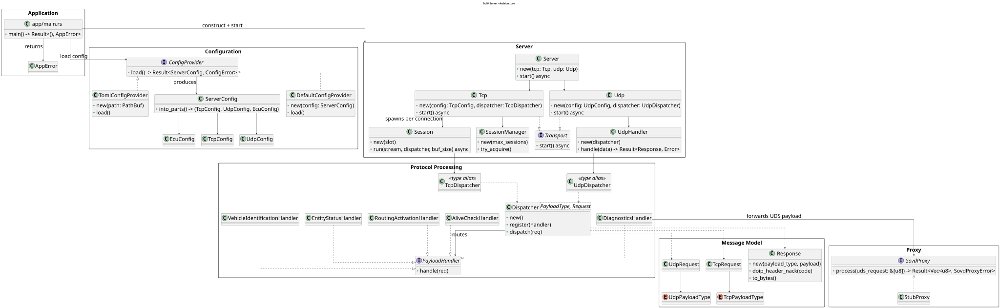
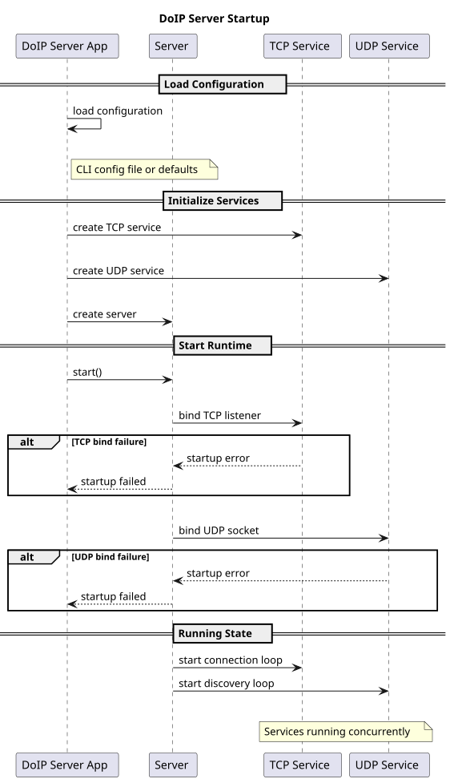
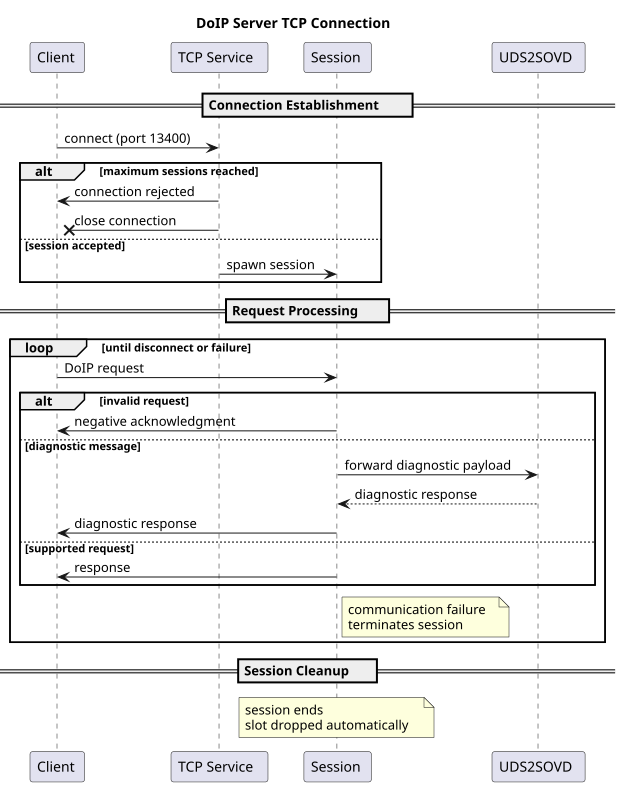
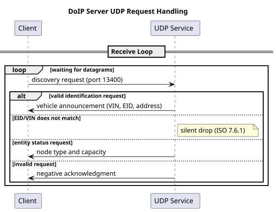

<!--
SPDX-License-Identifier: Apache-2.0
SPDX-FileCopyrightText: 2026 The Contributors to Eclipse OpenSOVD (see CONTRIBUTORS)

See the NOTICE file(s) distributed with this work for additional
information regarding copyright ownership.

This program and the accompanying materials are made available under the
terms of the Apache License Version 2.0 which is available at
https://www.apache.org/licenses/LICENSE-2.0
--> 
# High-Level Design

This document describes the system architecture, component responsibilities, runtime behaviour, and design rationale of the UDS-to-SOVD Proxy.

## Contents

- [System Context](#system-context)
- [Scope](#scope)
- [Architectural Goals](#architectural-goals)
- [Architecture Overview](#architecture-overview)
- [System Components](#system-components)
- [Component Responsibilities](#component-responsibilities)
- [Module Responsibilities](#module-responsibilities)
- [Runtime Flow](#runtime-flow)
- [Protocol Flow](#protocol-flow)
- [Design Decisions](#design-decisions)
- [Extension Points](#extension-points)
- [Related Documentation](#related-documentation)

## System Context

Modern vehicle diagnostics are transitioning from ECU-centric UDS communication toward service-oriented architectures. Diagnostic testers continue to use UDS over DoIP, while backends increasingly expose capabilities through SOVD interfaces.

The UDS-to-SOVD Proxy bridges these environments. It accepts DoIP communication from diagnostic tools, handles the transport and protocol concerns, and forwards diagnostic requests to a backend integration component (SOVD).

```text
Diagnostic Tester (UDS over DoIP)
            |
            v
    UDS-to-SOVD Proxy
    (this project)
            |
            v
      SOVD Backend
```

The proxy is not responsible for executing UDS services, managing diagnostic sessions at the application level, or implementing security access algorithms. Those responsibilities belong to the backend.

## Scope

**Supported:**

- Vehicle discovery
- Entity status requests
- Routing activation
- Alive checks
- Diagnostic message forwarding

Known functional, protocol, and operational limitations are documented in [Limitation](limitation.md).

## Architectural Goals

| Goal | What it means |
| --- | --- |
| **Modularity** | Components are organized by responsibility and communicate through explicit interfaces. |
| **Extensibility** | New handlers, configuration providers, and backend integrations can be added without modifying existing components. |
| **Protocol independence** | Transport, protocol, and backend modules are decoupled from each other. |
| **Testability** | All major components can be tested independently using stubs and mock implementations. |
| **Standards compliance** | Transport and protocol behaviour follow ISO 13400-2 (DoIP). |

## Architecture Overview



The application entry point wires all components together at startup. Configuration flows downward through the system, while diagnostic requests flow upward from the transport runtime through protocol processing and into backend integration components.

## System Components

| Component | Responsibility |
| --- | --- |
| Application | Startup and runtime wiring |
| Configuration | Configuration loading |
| Transport Runtime | TCP and UDP communication |
| Protocol Processing | Message dispatching and handler execution |
| Backend Integration | Diagnostic forwarding and backend abstraction |

## Component Responsibilities

### Application

The application entry point selects a configuration source, builds the transport services and their associated dispatchers, and starts the server runtime. It is the only place in the system where all components are wired together.

### Configuration

Responsible for loading and providing runtime configuration to the server.

**Key interfaces:**

- `ConfigProvider` - abstracts where configuration is loaded from
- `ServerConfig` - the complete runtime configuration model, split into TCP, UDP, and ECU sections

**Implementations:**

- `DefaultConfigProvider` - returns programmatic defaults; used for development and testing without a config file
- `TomlConfigProvider` - deserializes a TOML file; primary provider for production deployments

The server consumes a fully-constructed `ServerConfig`. It is unaware of how the configuration was produced or where it came from.

### Transport Runtime

Responsible for all network-level communication.

**TCP Runtime:**

- Accepts incoming connections and enforces the configured session limit
- Manages the lifecycle of each active session independently
- Frames the DoIP byte stream into individual messages and dispatches them
- Sends NACK responses when session capacity is exceeded or message parsing fails

**UDP Runtime:**

- Receives and parses individual DoIP datagrams
- Dispatches each datagram independently - there is no persistent session state on UDP

Both TCP and UDP implement the same `Transport` interface so they can be started concurrently without the server needing to know about their internal differences.

### Protocol Processing

Responsible for routing DoIP messages to the correct handler and generating responses.

**Dispatcher:**

The dispatcher routes protocol messages to handlers based on payload type. Separate dispatch paths are maintained for TCP and UDP traffic to preserve protocol correctness and reduce coupling between transports.

**Payload Handlers:**

Each handler is responsible for exactly one DoIP message type.

| Handler | Transport | Responsibility |
| --- | --- | --- |
| `RoutingActivationHandler` | TCP | Processes routing activation requests |
| `AliveCheckHandler` | TCP | Responds to keep-alive  |
| `DiagnosticsHandler` | TCP | Forwards UDS payloads to the backend proxy |
| `IdentifyVehicleHandler` | UDP | Responds to general vehicle identification requests |
| `IdentifyVehicleByEidHandler` | UDP | Responds to vehicle identification by EID |
| `IdentifyVehicleByVinHandler` | UDP | Responds to vehicle identification by VIN |
| `EntityStatusHandler` | UDP | Reports DoIP entity status |

Handlers are registered with the dispatcher at startup. Adding support for a new DoIP message type requires only implementing a new handler and registering it.

### Backend Integration

Defines the stable boundary between protocol processing and backend implementation.

**Key interface:**

- `SovdProxy` - receives raw UDS request bytes and returns raw UDS response bytes

**Current implementation:**

- `StubProxy` - returns a UDS negative response (NRC serviceNotSupported) for every request. This allows the server to run end-to-end without a real backend.

The `DiagnosticsHandler` calls the proxy without knowing which implementation is active. Replacing the stub with a real SOVD backend requires only providing a new `SovdProxy` implementation - no handler or transport code changes.

## Module Responsibilities

The following Rust modules implement the System Components defined above.

| Module | Responsibility |
| --- | --- |
| `config` | Implements the Configuration component: configuration loading traits, provider implementations, and runtime configuration model |
| `server` | Implements the Transport Runtime component: TCP and UDP runtime, session management, and connection lifecycle |
| `doip` | Implements the Protocol Processing component: dispatching, handler execution, and protocol error handling |
| `proxy` | Implements the Backend Integration component: backend abstraction trait and stub implementation |
| `error` | Supports cross-component error aggregation at the application boundary |

## Runtime Flow

### Startup



Intent: initialize configuration and start TCP/UDP runtimes together.

Primary flow:
1. Select configuration source from CLI path or built-in defaults.
2. Load and validate `ServerConfig`.
3. Build TCP and UDP dispatchers with registered handlers.
4. Construct TCP and UDP transport services.
5. Start server runtime and run both transports concurrently.
6. Keep running until shutdown is triggered.

Important branches:
- If TCP listener bind fails, startup fails and the application exits with an error.
- If UDP socket bind fails, startup fails and the application exits with an error.

Guarantees:
- Startup either reaches a running state with both transports active or fails fast.
- Configuration is resolved before any network service starts.

### TCP Request Processing



Intent: process DoIP requests per session while enforcing session limits.

Primary flow:
1. Accept incoming TCP connection.
2. Check session capacity.
3. Create a session task for accepted connections.
4. Read stream bytes and frame complete DoIP messages.
5. Dispatch each frame to the registered TCP handler.
6. Write handler response back to the client.

Important branches:
- If maximum sessions are reached, reject connection and close it.
- If a request is invalid, return a negative acknowledgment (NACK).
- If request is diagnostic, forward payload to backend proxy and return proxy response.
- Communication failure terminates the session loop.

Guarantees:
- Session slot is released automatically when the session ends.
- Capacity limits are enforced before request processing continues.

### UDP Request Processing



Intent: process each UDP datagram independently without session state.

Primary flow:
1. Receive UDP datagram.
2. Parse it as a complete DoIP message.
3. Dispatch to the matching UDP handler.
4. Send response to the originating address when applicable.

Important branches:
- For EID/VIN mismatch in discovery, silently drop (no response) per ISO 13400-2.
- For invalid requests, return a negative acknowledgment (NACK).

Guarantees:
- No persistent session state is created for UDP processing.
- Datagrams are handled independently.

## Design Decisions

### Configuration Provider Abstraction

Configuration loading is separated from the server runtime through a provider interface. The server receives a fully-constructed configuration object and remains unaware of how it was produced. This allows configuration sources (TOML file, programmatic defaults, future remote sources) to be swapped without touching server or transport code.

### Transport Segregation

Separate dispatch paths for TCP and UDP traffic ensure that protocol-specific logic remains isolated. This prevents the two transport paths from developing divergent behaviour over time and clarifies which handlers are appropriate for each transport.

### Automatic Session Lifecycle Management

Session resources are automatically released when connections terminate, reducing the risk of resource leaks. This approach removes the need for explicit cleanup calls regardless of how a session ends (clean close, network error, or internal failure).

### Backend Abstraction via `SovdProxy`

The `SovdProxy` interface isolates the diagnostic handler from any specific backend. The stub implementation allows the server to run fully without a real backend, which is useful for protocol-level testing and early development. Replacing the backend requires only a new implementation of the interface.

### Error-to-NACK Mapping

Each protocol error maps explicitly to the correct DoIP Generic Header NACK code. The mapping is centralized so that transport code does not need to make decisions about which NACK code applies to which error condition.

## Extension Points

| Extension Point | How to extend |
| --- | --- |
| `ConfigProvider` | Implement the trait to add new configuration sources (environment variables, remote config, etc.) |
| `PayloadHandler` | Implement the trait and register with the dispatcher to handle new DoIP message types |
| `SovdProxy` | Implement the trait to connect a real SOVD backend, simulation, or alternative diagnostic system |

## Related Documentation

| Document | Purpose |
| --- | --- |
| [Usage](usage.md) | Build, configuration, and operation |
| [Limitations](limitation.md) | Current functional, protocol, and operational constraints |
| [TODO](todo.md) | Planned enhancements and roadmap |
