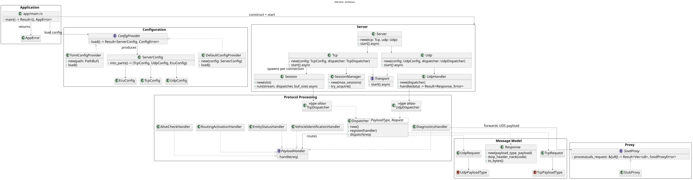

<!--
SPDX-License-Identifier: Apache-2.0
SPDX-FileCopyrightText: 2026 The Contributors to Eclipse OpenSOVD (see CONTRIBUTORS)

See the NOTICE file(s) distributed with this work for additional
information regarding copyright ownership.

This program and the accompanying materials are made available under the
terms of the Apache License Version 2.0 which is available at
https://www.apache.org/licenses/LICENSE-2.0
--> 
# UDS2SOVD - DoIP Server - High-Level Design

This document describes the system architecture, component responsibilities, runtime behaviour, and design rationale of the UDS-to-SOVD DoIP server.
For project introduction and getting started, see [README.md](../README.md).

## Contents

- [System Context](#system-context)
- [Scope](#scope)
- [Architectural Goals](#architectural-goals)
- [Architecture Overview](#architecture-overview)
- [Layers](#layers)
- [Component Responsibilities](#component-responsibilities)
- [Module Responsibilities](#module-responsibilities)
- [Runtime Flow](#runtime-flow)
- [Protocol Flow](#protocol-flow)
- [Design Decisions](#design-decisions)
- [Extension Points](#extension-points)
- [Related Documentation](#related-documentation)

---

## System Context

Modern vehicle diagnostics are transitioning from ECU-centric UDS communication toward service-oriented architectures. Diagnostic testers continue to use UDS over DoIP, while backends increasingly expose capabilities through SOVD interfaces.

The UDS-to-SOVD proxy bridges these environments. It accepts DoIP communication from diagnostic tools, handles the transport and protocol concerns, and forwards diagnostic requests to a backend integration layer (SOVD ).

```text
Diagnostic Tester (UDS over DoIP)
            |
            v
    UDS-to-SOVD Proxy
    (this project)
            |
            v
      SOVD Backend
```

The proxy is not responsible for executing UDS services, managing diagnostic sessions at the application level, or implementing security access algorithms. Those responsibilities belong to the backend.

---

## Scope

**Supported:**

- Vehicle discovery
- Entity status requests
- Routing activation
- Alive checks
- Diagnostic message forwarding

Known functional, protocol, and operational limitations are documented in [LIMITATIONS.md](LIMITATIONS.md).

---

## Architectural Goals

| Goal | What it means |
| --- | --- |
| **Modularity** | Components are organized by responsibility and communicate through explicit interfaces. |
| **Extensibility** | New handlers, configuration providers, and backend integrations can be added without modifying existing components. |
| **Protocol independence** | Transport, protocol, and backend layers are decoupled from each other. |
| **Testability** | All major components can be tested independently using stubs and mock implementations. |
| **Standards compliance** | Transport and protocol behaviour follow ISO 13400-2 (DoIP). |

---

## Architecture Overview

The system is organized into five layers communicating top-to-bottom:

<!--  -->



The application entry point wires all layers together at startup. Configuration flows downward through the system, while diagnostic requests flow upward from the transport layer through protocol processing and into backend integration components.

---

## Layers

| Layer | Responsibility |
| --- | --- |
| Application | Startup and runtime wiring |
| Configuration | Configuration loading and runtime models |
| Transport Runtime | TCP and UDP communication |
| Protocol Processing | Message dispatching and handler execution |
| Backend Integration | Diagnostic forwarding and backend abstraction |

---

## Component Responsibilities

### Application

The application entry point selects a configuration source, builds the transport services and their associated dispatchers, and starts the server runtime. It is the only place in the system where all components are wired together.

---

### Configuration

Responsible for loading and providing runtime configuration to the server.

**Key interfaces:**

- `ConfigProvider` - abstracts where configuration is loaded from
- `ServerConfig` - the complete runtime configuration model, split into TCP, UDP, and ECU sections

**Implementations:**

- `DefaultConfigProvider` - returns programmatic defaults; used for development and testing without a config file
- `TomlConfigProvider` - deserializes a TOML file; primary provider for production deployments

The server consumes a fully-constructed `ServerConfig`. It is unaware of how the configuration was produced or where it came from.

---

### Transport Runtime

Responsible for all network-level communication.

**TCP Runtime:**

- Accepts incoming connections and enforces the configured session limit
- Manages the lifecycle of each active session independently
- Frames the DoIP byte stream into individual messages and dispatches them
- Sends NACK responses when session capacity is exceeded or message parsing fails

**UDP Runtime:**

- Receives and parses individual DoIP datagrams
- Dispatches each datagram independently - there is no persistent session state on UDP

Both TCP and UDP implement the same `Transport` interface so they can be started concurrently without the server needing to know about their internal differences.

---

### Protocol Processing

Responsible for routing DoIP messages to the correct handler and generating responses.

**Dispatcher:**

The dispatcher routes protocol messages to handlers based on payload type. Separate dispatch paths are maintained for TCP and UDP traffic to preserve protocol correctness and reduce coupling between transports.

**Payload Handlers:**

Each handler is responsible for exactly one DoIP message type.

| Handler | Transport | Responsibility |
| --- | --- | --- |
| `RoutingActivationHandler` | TCP | Processes routing activation requests |
| `AliveCheckHandler` | TCP | Responds to keep-alive  |
| `DiagnosticsHandler` | TCP | Forwards UDS payloads to the backend proxy |
| `VehicleIdentificationHandler` | UDP | Responds to vehicle identification requests (general, EID, VIN) |
| `EntityStatusHandler` | UDP | Reports DoIP entity status |

Handlers are registered with the dispatcher at startup. Adding support for a new DoIP message type requires only implementing a new handler and registering it.

---

### Backend Integration

Defines the stable boundary between protocol processing and backend implementation.

**Key interface:**

- `SovdProxy` - receives raw UDS request bytes and returns raw UDS response bytes

**Current implementation:**

- `StubProxy` - returns a UDS negative response (NRC serviceNotSupported) for every request. This allows the server to run end-to-end without a real backend.

The `DiagnosticsHandler` calls the proxy without knowing which implementation is active. Replacing the stub with a real SOVD backend requires only providing a new `SovdProxy` implementation - no handler or transport code changes.

---

## Module Responsibilities

| Module | Responsibility |
| --- | --- |
| `config` | Configuration loading trait, provider implementations, runtime config model |
| `server` | TCP and UDP transport runtime, session management, connection lifecycle |
| `doip` | DoIP message dispatching, handler execution, protocol error handling |
| `proxy` | Backend abstraction trait and stub implementation |
| `error` | Top-level application error type aggregating all sub-system errors |

---

## Runtime Flow

### Startup

At startup, the application:

1. Selects a configuration source based on program arguments (TOML file or defaults)
2. Loads the server configuration
3. Builds the TCP dispatcher with all TCP handlers registered
4. Builds the UDP dispatcher with all UDP handlers registered
5. Constructs the TCP and UDP transport services
6. Starts both transports concurrently and waits for shutdown

### TCP Request Processing

For each incoming TCP connection:

1. The transport accepts the connection and checks whether capacity is available
2. If capacity is exceeded, a NACK is sent and the connection is dropped
3. If capacity is available, a session is created and driven in a dedicated task
4. The session reads bytes from the stream and extracts complete DoIP frames
5. Each frame is dispatched to the registered handler
6. The handler response is written back to the client
7. When the session ends for any reason, the session slot is released automatically

### UDP Request Processing

For each incoming UDP datagram:

1. The transport receives the datagram
2. The datagram is parsed as a single complete DoIP message
3. The message is dispatched to the registered handler
4. The handler response is sent back to the originating address
5. For discovery requests where the entity's identity does not match, no response is sent (per ISO 13400-2)

---

## Protocol Flow

### Vehicle Discovery

A tester broadcasts a vehicle identification request over UDP. The matching handler responds with an announcement containing the entity's VIN, EID, GID, and logical address.

```text
VehicleIdentificationRequest (UDP)
  -> Dispatcher
  -> VehicleIdentificationHandler (general / by EID / by VIN)
  -> VehicleAnnouncementResponse
```

### Routing Activation

A tester opens a TCP connection and sends a routing activation request to establish a diagnostic session.

```text
RoutingActivationRequest (TCP)
  -> Dispatcher
  -> RoutingActivationHandler
  -> RoutingActivationResponse
```

### Alive Check

The tester or server sends an alive check to confirm the connection is still active.

```text
AliveCheckRequest (TCP)
  -> Dispatcher
  -> AliveCheckHandler
  -> AliveCheckResponse
```

### Diagnostic Communication

The tester sends a UDS diagnostic request. The server extracts the UDS payload, forwards it to the backend proxy, and returns the response.

```text
DiagnosticMessage (TCP)
  -> Dispatcher
  -> DiagnosticsHandler
  -> SovdProxy::process(uds_bytes)
  -> DiagnosticMessagePositiveAck
```

---

## Design Decisions

### Configuration Provider Abstraction

Configuration loading is separated from the server runtime through a provider interface. The server receives a fully-constructed configuration object and remains unaware of how it was produced. This allows configuration sources (TOML file, programmatic defaults, future remote sources) to be swapped without touching server or transport code.

### Transport Segregation

Separate dispatch paths for TCP and UDP traffic ensure that protocol-specific logic remains isolated. This prevents the two transport paths from developing divergent behaviour over time and clarifies which handlers are appropriate for each transport.

### Automatic Session Lifecycle Management

Session resources are automatically released when connections terminate, reducing the risk of resource leaks. This approach removes the need for explicit cleanup calls regardless of how a session ends (clean close, network error, or internal failure).

### Backend Abstraction via `SovdProxy`

The `SovdProxy` interface isolates the diagnostic handler from any specific backend. The stub implementation allows the server to run fully without a real backend, which is useful for protocol-level testing and early development. Replacing the backend requires only a new implementation of the interface.

### Error-to-NACK Mapping

Each protocol error maps explicitly to the correct DoIP Generic Header NACK code. The mapping is centralized so that transport code does not need to make decisions about which NACK code applies to which error condition.

---

## Extension Points

| Extension Point | How to extend |
| --- | --- |
| `ConfigProvider` | Implement the trait to add new configuration sources (environment variables, remote config, etc.) |
| `PayloadHandler` | Implement the trait and register with the dispatcher to handle new DoIP message types |
| `SovdProxy` | Implement the trait to connect a real SOVD backend, simulation, or alternative diagnostic system |
| `Transport` | Implement the trait to add new transport types if required |

---

## Related Documentation

| Document | Purpose |
| --- | --- |
| [Doip Server Architecture](doip_server_architecture.svg) | Component architecture diagram |
| [Doip Server Architecture Module Structure](doip_server_architecture_module_structure.svg) | Module structure diagram |
